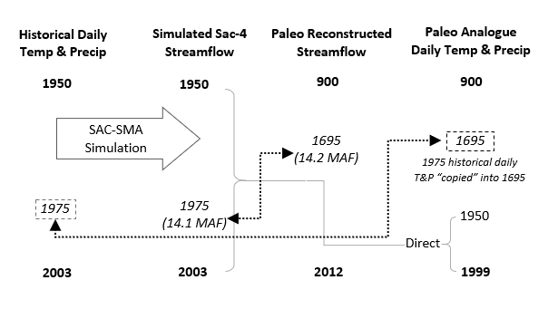

# Paleo Bootstrapping
The paleo-dendrochronology reconstructed record of Sacramento 4-river annual streamflow (900–2013) (Meko et al. 2014) is coupled with historical daily (detrended) temperature and precipitation from 1950–2013 (Livneh et al. 2013) to generate a 1,100-year climate trace. The reconstructed Sacramento 4-river annual flow provides information about long-term inter-annual variability through a 1,100-year record of the wet and dry cycles that the Delta catchment (i.e. watershed area contributing to inflow to Sacramento-San Joaquin Delta) has endured. The daily temperature and precipitation provide information about the spatiotemporal distribution of weather that produced such annual streamflow.

The Sacramento 4-river annual streamflow is the aggregate annual water-year (October 1–September 30) streamflow of the *Sacramento River at Bend Bridge*, the *American River inflow to Folsom Reservoir*, the *Yuba River at Smartsville*, and *Feather River inflow to Oroville Reservoir*. The Sacramento 4-river annual represents the majority of inflows contributing to the Delta catchment. Additional flows of the Delta catchment not covered by the Sacramento 4-river annual streamflow are highly correlated to the Sacramento 4-river flow (Meko et. al. 2014).

## Processing Steps
The following steps are executed in the `paleo-coupling.r` script to link the historical 50-year daily temperature and precipitation record to the 1,100-year paleodendrochronological record:

- **Step 1:** Prior to using the historical observed temperature data, it was necessary to remove the linear warming trend in the data. Temperature detrending was achieved by applying a linear trend to the data so that the detrended temperature time series had a trend line of slope zero and an average value equal to the average temperature from 1981 through 2010. This procedure was applied to each grid cell across the CVS watershed. The detrended historical temperature allows reference to current and recent historical conditions when developing the stress test as opposed to a more abstract reference to mid-20th-century temperatures at the mean of the historical time series. Furthermore, detrending was necessary to ensure the same average temperature reference is maintained across the 1,100-year coupled sequence. The observed historical precipitation data showed no trend, thus required no detrending.

- **Step 2:** Using the historical (1950–2003) detrended temperature and precipitation data as input, the Sacramento Soil Moisture Accounting distributed hydrologic model (SAC-SMA-DS) was used to simulate streamflows in the Sacramento, Feather, Yuba, and American rivers of the Sacramento basin to generate the Sacramento 4-river annual streamflow.

- **Step 3:** For each paleo-drendrochronology reconstructed Sacramento 4-river annual streamflow from 900 through 1949, the closest historical observed (1950–2003) analog flow was associated with it.

- **Step 4:** The historical (1950–2003) detrended temperature and precipitation data for the water year of the analog historical observed flow was then copied into the historical reconstructed years.

# References
Meko, David M., Connie A. Woodhouse, and Ramzi Touchan. 2014. “Klamath / San Joaquin / Sacramento Hydroclimatic Reconstructions from Tree Rings.”

Livneh, B., E. A. Rosenberg, C. Lin, B. Nijssen, V. Mishra, K. M. Andreadis, E. P. Maurer, and D. P. Lettenmaier (2013), A Long-Term Hydrologically Based Dataset of Land Surface Fluxes and States for the Conterminous United States: Update and Extensions, J. Clim., 26, 9384-9392.

# Contact
[Wyatt Arnold](mailto:wyatt.arnold@water.ca.gov) 
Engineer, Water Resources 
Climate Change Program 
California Department of Water Resources
